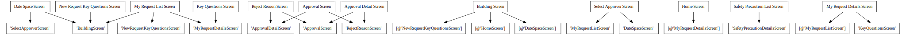

# Power App Documentation \- Building Access

| Property                   | Value                                   |
| -------------------------- | --------------------------------------- |
| App Name                   | Building Access                         |
| App Logo                   |  |
| Documentation generated at | Wednesday, 30 November 2022 10:07 am    |

- [Overview](index-Building-Access.md)
- [App Details](appdetails-Building-Access.md)
- [Variables](variables-Building-Access.md)
- [DataSources](datasources-Building-Access.md)
- [Resources](resources-Building-Access.md)
- [Controls](controls-Building-Access.md)

## Controls Overview

A total of 13 Screens are located in the app.

A total of 325 Controls are located in the app.

### [Screen: Approval Detail Screen](screen-Approval-Detail-Screen-Building-Access.md)

- [ Approval Detail Screen](screen-Approval-Detail-Screen-Building-Access.md#approval-detail-screen)
- - [ btnCancelReject](screen-Approval-Detail-Screen-Building-Access.md#btncancelreject)
- - [ btnReject](screen-Approval-Detail-Screen-Building-Access.md#btnreject)
- - [ btnRequestApprove](screen-Approval-Detail-Screen-Building-Access.md#btnrequestapprove)
- - [ btnRequestReject](screen-Approval-Detail-Screen-Building-Access.md#btnrequestreject)
- - [ BuildingCardApprovalDetail](screen-Approval-Detail-Screen-Building-Access.md#buildingcardapprovaldetail)
- - [ ctrlRejectionReasonApprovalDetail](screen-Approval-Detail-Screen-Building-Access.md#ctrlrejectionreasonapprovaldetail)
- - [ grpErrorMessage\_3](screen-Approval-Detail-Screen-Building-Access.md#grperrormessage_3)
- - [ HeaderControlApprovalRequestDetails](screen-Approval-Detail-Screen-Building-Access.md#headercontrolapprovalrequestdetails)
- - [ icnErrorCancel\_3](screen-Approval-Detail-Screen-Building-Access.md#icnerrorcancel_3)
- - [ imgApprovalBackApprovalDetail](screen-Approval-Detail-Screen-Building-Access.md#imgapprovalbackapprovaldetail)
- - [ imgBuildingDetailsBorder](screen-Approval-Detail-Screen-Building-Access.md#imgbuildingdetailsborder)
- - [ imgErrorInfo\_3](screen-Approval-Detail-Screen-Building-Access.md#imgerrorinfo_3)
- - [ imgReasonAccessBorder](screen-Approval-Detail-Screen-Building-Access.md#imgreasonaccessborder)
- - [ lblErrorBackRectangle\_3](screen-Approval-Detail-Screen-Building-Access.md#lblerrorbackrectangle_3)
- - [ lblErrorMessage\_3](screen-Approval-Detail-Screen-Building-Access.md#lblerrormessage_3)
- - [ lblErrorRectangle\_3](screen-Approval-Detail-Screen-Building-Access.md#lblerrorrectangle_3)
- - [ rctAlertBackDropApprovalDetail](screen-Approval-Detail-Screen-Building-Access.md#rctalertbackdropapprovaldetail)
- - [ SeperatorFeedApprovalDetail](screen-Approval-Detail-Screen-Building-Access.md#seperatorfeedapprovaldetail)
- - [ shpRectangleBackGround\_ApprovalDetailScreen](screen-Approval-Detail-Screen-Building-Access.md#shprectanglebackground_approvaldetailscreen)
- - [ shpUpperRectangle\_ApprovalDetailScreen](screen-Approval-Detail-Screen-Building-Access.md#shpupperrectangle_approvaldetailscreen)

### [Screen: Approval Screen](screen-Approval-Screen-Building-Access.md)

- [ Approval Screen](screen-Approval-Screen-Building-Access.md#approval-screen)
- - [ AlertBackDrop](screen-Approval-Screen-Building-Access.md#alertbackdrop)
- - [ btnApproveSelected](screen-Approval-Screen-Building-Access.md#btnapproveselected)
- - [ btnCancel](screen-Approval-Screen-Building-Access.md#btncancel)
- - [ btnRejectApproval](screen-Approval-Screen-Building-Access.md#btnrejectapproval)
- - [ btnRejectSelected](screen-Approval-Screen-Building-Access.md#btnrejectselected)
- - [ chkSelectAll](screen-Approval-Screen-Building-Access.md#chkselectall)
- - [ ctrlRejectionReason](screen-Approval-Screen-Building-Access.md#ctrlrejectionreason)
- - [ glryApprovals](screen-Approval-Screen-Building-Access.md#glryapprovals)
  - - [ chkSelectRequest](screen-Approval-Screen-Building-Access.md#chkselectrequest)
  - - [ galleryTemplate1](screen-Approval-Screen-Building-Access.md#gallerytemplate1)
  - - [ icnInformation](screen-Approval-Screen-Building-Access.md#icninformation)
  - - [ imgInfo](screen-Approval-Screen-Building-Access.md#imginfo)
  - - [ lblRequestor](screen-Approval-Screen-Building-Access.md#lblrequestor)
  - - [ lblRequestTitle](screen-Approval-Screen-Building-Access.md#lblrequesttitle)
  - - [ lblTitle](screen-Approval-Screen-Building-Access.md#lbltitle)
  - - [ requestSeparator](screen-Approval-Screen-Building-Access.md#requestseparator)
- - [ grpErrorMessage\_1](screen-Approval-Screen-Building-Access.md#grperrormessage_1)
- - [ HeaderControlApproval](screen-Approval-Screen-Building-Access.md#headercontrolapproval)
- - [ icnErrorCancel\_1](screen-Approval-Screen-Building-Access.md#icnerrorcancel_1)
- - [ icnFilter](screen-Approval-Screen-Building-Access.md#icnfilter)
- - [ icnSearchApproval](screen-Approval-Screen-Building-Access.md#icnsearchapproval)
- - [ imgApprovalBack](screen-Approval-Screen-Building-Access.md#imgapprovalback)
- - [ imgErrorInfo\_1](screen-Approval-Screen-Building-Access.md#imgerrorinfo_1)
- - [ imgGalleryApprovalsBorder](screen-Approval-Screen-Building-Access.md#imggalleryapprovalsborder)
- - [ lblErrorBackRectangle\_1](screen-Approval-Screen-Building-Access.md#lblerrorbackrectangle_1)
- - [ lblErrorMessage\_1](screen-Approval-Screen-Building-Access.md#lblerrormessage_1)
- - [ lblErrorRectangle\_1](screen-Approval-Screen-Building-Access.md#lblerrorrectangle_1)
- - [ lblSelectAll](screen-Approval-Screen-Building-Access.md#lblselectall)
- - [ rctRejectApproved](screen-Approval-Screen-Building-Access.md#rctrejectapproved)
- - [ SeperatorFeedApproval](screen-Approval-Screen-Building-Access.md#seperatorfeedapproval)
- - [ shpRectangleBackGround\_ApprovalScreen](screen-Approval-Screen-Building-Access.md#shprectanglebackground_approvalscreen)
- - [ shpUpperRectangle\_ApprovalScreen](screen-Approval-Screen-Building-Access.md#shpupperrectangle_approvalscreen)
- - [ txtApprovalsSearch](screen-Approval-Screen-Building-Access.md#txtapprovalssearch)

### [Screen: Building Screen](screen-Building-Screen-Building-Access.md)

- [ Building Screen](screen-Building-Screen-Building-Access.md#building-screen)
- - [ btnBackBuildingScreen](screen-Building-Screen-Building-Access.md#btnbackbuildingscreen)
- - [ btnSave&NextBuildingScreen](screen-Building-Screen-Building-Access.md#btnsave&nextbuildingscreen)
- - [ cmbSelectBuilding](screen-Building-Screen-Building-Access.md#cmbselectbuilding)
- - [ grpBusinessReason](screen-Building-Screen-Building-Access.md#grpbusinessreason)
- - [ grpEligibilityCriteria.](screen-Building-Screen-Building-Access.md#grpeligibilitycriteria.)
- - [ grpSelectBuilding](screen-Building-Screen-Building-Access.md#grpselectbuilding)
- - [ HeaderControlSelectBuilding](screen-Building-Screen-Building-Access.md#headercontrolselectbuilding)
- - [ htmlEligibilityText](screen-Building-Screen-Building-Access.md#htmleligibilitytext)
- - [ lblBusinessReason](screen-Building-Screen-Building-Access.md#lblbusinessreason)
- - [ lblEligibility](screen-Building-Screen-Building-Access.md#lbleligibility)
- - [ lblSelectBuilding](screen-Building-Screen-Building-Access.md#lblselectbuilding)
- - [ lblSelectBuildingHeader](screen-Building-Screen-Building-Access.md#lblselectbuildingheader)
- - [ NavigationComponentSelectBuilding](screen-Building-Screen-Building-Access.md#navigationcomponentselectbuilding)
- - [ shpBuildingSeparator](screen-Building-Screen-Building-Access.md#shpbuildingseparator)
- - [ shpReasonSeparator](screen-Building-Screen-Building-Access.md#shpreasonseparator)
- - [ shpRectangleBackGround\_BuildingScreen](screen-Building-Screen-Building-Access.md#shprectanglebackground_buildingscreen)
- - [ shpUpperRectangle\_BuildingScreen](screen-Building-Screen-Building-Access.md#shpupperrectangle_buildingscreen)
- - [ txtBusinessReason](screen-Building-Screen-Building-Access.md#txtbusinessreason)
- - [ txtEligibilityCriteria](screen-Building-Screen-Building-Access.md#txteligibilitycriteria)

### [Screen: Date Space Screen](screen-Date-Space-Screen-Building-Access.md)

- [ Date Space Screen](screen-Date-Space-Screen-Building-Access.md#date-space-screen)
- - [ btnBackDateScreen](screen-Date-Space-Screen-Building-Access.md#btnbackdatescreen)
- - [ btnSave&NextDateScreen](screen-Date-Space-Screen-Building-Access.md#btnsave&nextdatescreen)
- - [ DateSpaceCanvas](screen-Date-Space-Screen-Building-Access.md#datespacecanvas)
  - - [ DateSpaceDataCard](screen-Date-Space-Screen-Building-Access.md#datespacedatacard)
    - - [ btnCheckAvailability](screen-Date-Space-Screen-Building-Access.md#btncheckavailability)
    - - [ cmbSelectSlot](screen-Date-Space-Screen-Building-Access.md#cmbselectslot)
    - - [ cmbSelectSpace](screen-Date-Space-Screen-Building-Access.md#cmbselectspace)
    - - [ datepkEndDate](screen-Date-Space-Screen-Building-Access.md#datepkenddate)
    - - [ datepkStartDate](screen-Date-Space-Screen-Building-Access.md#datepkstartdate)
    - - [ glryAvailableDate&Space](screen-Date-Space-Screen-Building-Access.md#glryavailabledate&space)
      - - [ galleryTemplate4\_2](screen-Date-Space-Screen-Building-Access.md#gallerytemplate4_2)
      - - [ icnNextArrow2](screen-Date-Space-Screen-Building-Access.md#icnnextarrow2)
      - - [ imgDown2](screen-Date-Space-Screen-Building-Access.md#imgdown2)
      - - [ lblBuildingTitle2](screen-Date-Space-Screen-Building-Access.md#lblbuildingtitle2)
      - - [ lblDateExtra](screen-Date-Space-Screen-Building-Access.md#lbldateextra)
      - - [ lblSpaceName2](screen-Date-Space-Screen-Building-Access.md#lblspacename2)
      - - [ lblTimeSlotExtra](screen-Date-Space-Screen-Building-Access.md#lbltimeslotextra)
      - - [ shpAvailableDateGalleryRectangle](screen-Date-Space-Screen-Building-Access.md#shpavailabledategalleryrectangle)
    - - [ glryReservedDate&Space](screen-Date-Space-Screen-Building-Access.md#glryreserveddate&space)
      - - [ galleryTemplate5\_2](screen-Date-Space-Screen-Building-Access.md#gallerytemplate5_2)
      - - [ icnNextArrow](screen-Date-Space-Screen-Building-Access.md#icnnextarrow)
      - - [ imgDown](screen-Date-Space-Screen-Building-Access.md#imgdown)
      - - [ lblBuildingTitle](screen-Date-Space-Screen-Building-Access.md#lblbuildingtitle)
      - - [ lblSpaceName](screen-Date-Space-Screen-Building-Access.md#lblspacename)
      - - [ lblTimeSlotValue](screen-Date-Space-Screen-Building-Access.md#lbltimeslotvalue)
      - - [ shpReservedDateGalleryRectangle](screen-Date-Space-Screen-Building-Access.md#shpreserveddategalleryrectangle)
    - - [ glryReservedSpace](screen-Date-Space-Screen-Building-Access.md#glryreservedspace)
      - - [ galleryTemplate3](screen-Date-Space-Screen-Building-Access.md#gallerytemplate3)
      - - [ Title2](screen-Date-Space-Screen-Building-Access.md#title2)
    - - [ grpEndDate](screen-Date-Space-Screen-Building-Access.md#grpenddate)
    - - [ grpSelectSlot](screen-Date-Space-Screen-Building-Access.md#grpselectslot)
    - - [ grpSelectSpace](screen-Date-Space-Screen-Building-Access.md#grpselectspace)
    - - [ grpStartDate](screen-Date-Space-Screen-Building-Access.md#grpstartdate)
    - - [ lblDateAndSpaceError](screen-Date-Space-Screen-Building-Access.md#lbldateandspaceerror)
    - - [ lblEndDate](screen-Date-Space-Screen-Building-Access.md#lblenddate)
    - - [ lblReservedSpaces](screen-Date-Space-Screen-Building-Access.md#lblreservedspaces)
    - - [ lblSelectDate\/SpaceHeader](screen-Date-Space-Screen-Building-Access.md#lblselectdate/spaceheader)
    - - [ lblSelectedDateAndSpace](screen-Date-Space-Screen-Building-Access.md#lblselecteddateandspace)
    - - [ lblSelectSlot](screen-Date-Space-Screen-Building-Access.md#lblselectslot)
    - - [ lblSelectSpace](screen-Date-Space-Screen-Building-Access.md#lblselectspace)
    - - [ lblStartDate](screen-Date-Space-Screen-Building-Access.md#lblstartdate)
    - - [ lblTimeSlotError](screen-Date-Space-Screen-Building-Access.md#lbltimesloterror)
    - - [ lblToggleButton](screen-Date-Space-Screen-Building-Access.md#lbltogglebutton)
    - - [ shpEndDateSeparator](screen-Date-Space-Screen-Building-Access.md#shpenddateseparator)
    - - [ shpRectangleExtra](screen-Date-Space-Screen-Building-Access.md#shprectangleextra)
    - - [ shpSlotSeparator](screen-Date-Space-Screen-Building-Access.md#shpslotseparator)
    - - [ shpSpaceSeparator](screen-Date-Space-Screen-Building-Access.md#shpspaceseparator)
    - - [ shpStartDateSeparator](screen-Date-Space-Screen-Building-Access.md#shpstartdateseparator)
    - - [ togDay](screen-Date-Space-Screen-Building-Access.md#togday)
- - [ HeaderControlSelectDateAndSpace](screen-Date-Space-Screen-Building-Access.md#headercontrolselectdateandspace)
- - [ icnErrorCancel\_4](screen-Date-Space-Screen-Building-Access.md#icnerrorcancel_4)
- - [ imgErrorInfo\_4](screen-Date-Space-Screen-Building-Access.md#imgerrorinfo_4)
- - [ lblErrorBackRectangle\_4](screen-Date-Space-Screen-Building-Access.md#lblerrorbackrectangle_4)
- - [ lblErrorMessage\_4](screen-Date-Space-Screen-Building-Access.md#lblerrormessage_4)
- - [ lblErrorRectangle\_4](screen-Date-Space-Screen-Building-Access.md#lblerrorrectangle_4)
- - [ NavigationComponentSelectDateAndSpace](screen-Date-Space-Screen-Building-Access.md#navigationcomponentselectdateandspace)
- - [ shpRectangleBackGround\_DateSpaceScreen](screen-Date-Space-Screen-Building-Access.md#shprectanglebackground_datespacescreen)
- - [ shpUpperRectangle\_DateSpaceScreen](screen-Date-Space-Screen-Building-Access.md#shpupperrectangle_datespacescreen)

### [Screen: Home Screen](screen-Home-Screen-Building-Access.md)

- [ Home Screen](screen-Home-Screen-Building-Access.md#home-screen)
- - [ glryReservation](screen-Home-Screen-Building-Access.md#glryreservation)
  - - [ galleryTemplate7\_1](screen-Home-Screen-Building-Access.md#gallerytemplate7_1)
  - - [ imgArrow](screen-Home-Screen-Building-Access.md#imgarrow)
  - - [ lblBuildingInfo](screen-Home-Screen-Building-Access.md#lblbuildinginfo)
  - - [ lblTimeSlot](screen-Home-Screen-Building-Access.md#lbltimeslot)
  - - [ rectReservation](screen-Home-Screen-Building-Access.md#rectreservation)
- - [ HomePageMenus](screen-Home-Screen-Building-Access.md#homepagemenus)
- - [ icnReload](screen-Home-Screen-Building-Access.md#icnreload)
- - [ lblTodaysReservation](screen-Home-Screen-Building-Access.md#lbltodaysreservation)
- - [ lblUserDescription](screen-Home-Screen-Building-Access.md#lbluserdescription)
- - [ lblUserTitle](screen-Home-Screen-Building-Access.md#lblusertitle)
- - [ shpRectangleBackGround\_HomeScreen](screen-Home-Screen-Building-Access.md#shprectanglebackground_homescreen)
- - [ shpSeparatorRectangle](screen-Home-Screen-Building-Access.md#shpseparatorrectangle)
- - [ shpUpperRectangle\_HomeScreen](screen-Home-Screen-Building-Access.md#shpupperrectangle_homescreen)

### [Screen: Key Questions Screen](screen-Key-Questions-Screen-Building-Access.md)

- [ Key Questions Screen](screen-Key-Questions-Screen-Building-Access.md#key-questions-screen)
- - [ btnSubmitKeyQuestions](screen-Key-Questions-Screen-Building-Access.md#btnsubmitkeyquestions)
- - [ grpErrorMessage\_KeyquestionsScreen](screen-Key-Questions-Screen-Building-Access.md#grperrormessage_keyquestionsscreen)
- - [ HeaderControlKeyEligibilityQuestions](screen-Key-Questions-Screen-Building-Access.md#headercontrolkeyeligibilityquestions)
- - [ htmlErrorMessage\_KeyquestionsScreens](screen-Key-Questions-Screen-Building-Access.md#htmlerrormessage_keyquestionsscreens)
- - [ icnErrorCancel\_KeyquestionsScreen](screen-Key-Questions-Screen-Building-Access.md#icnerrorcancel_keyquestionsscreen)
- - [ imgErrorInfo\_KeyquestionsScreen](screen-Key-Questions-Screen-Building-Access.md#imgerrorinfo_keyquestionsscreen)
- - [ KeyQuestionsListComponent](screen-Key-Questions-Screen-Building-Access.md#keyquestionslistcomponent)
- - [ lblErrorBackRectangle\_KeyquestionsScreen](screen-Key-Questions-Screen-Building-Access.md#lblerrorbackrectangle_keyquestionsscreen)
- - [ lblErrorMessage\_KeyquestionsScreen](screen-Key-Questions-Screen-Building-Access.md#lblerrormessage_keyquestionsscreen)
- - [ lblErrorRectangle\_KeyquestionsScreen](screen-Key-Questions-Screen-Building-Access.md#lblerrorrectangle_keyquestionsscreen)
- - [ shpRectangleBackGround\_KeyQuestionsScreen](screen-Key-Questions-Screen-Building-Access.md#shprectanglebackground_keyquestionsscreen)
- - [ shpUpperRectangle\_KeyQuestionsScreen](screen-Key-Questions-Screen-Building-Access.md#shpupperrectangle_keyquestionsscreen)

### [Screen: My Request Details Screen](screen-My-Request-Details-Screen-Building-Access.md)

- [ My Request Details Screen](screen-My-Request-Details-Screen-Building-Access.md#my-request-details-screen)
- - [ btnCheckIn](screen-My-Request-Details-Screen-Building-Access.md#btncheckin)
- - [ btnCheckOut](screen-My-Request-Details-Screen-Building-Access.md#btncheckout)
- - [ btnNo](screen-My-Request-Details-Screen-Building-Access.md#btnno)
- - [ btnWithdraw](screen-My-Request-Details-Screen-Building-Access.md#btnwithdraw)
- - [ btnYes](screen-My-Request-Details-Screen-Building-Access.md#btnyes)
- - [ GrpCheckInCheckOut](screen-My-Request-Details-Screen-Building-Access.md#grpcheckincheckout)
- - [ grpCheckInSuccessMessage](screen-My-Request-Details-Screen-Building-Access.md#grpcheckinsuccessmessage)
- - [ grpCheckOutSuccessMessage](screen-My-Request-Details-Screen-Building-Access.md#grpcheckoutsuccessmessage)
- - [ GrpWithdrawAlert](screen-My-Request-Details-Screen-Building-Access.md#grpwithdrawalert)
- - [ HeaderControlRequestDetails](screen-My-Request-Details-Screen-Building-Access.md#headercontrolrequestdetails)
- - [ icnErrorCancel\_5](screen-My-Request-Details-Screen-Building-Access.md#icnerrorcancel_5)
- - [ icnErrorCancel\_KeyquestionsScreen\_1](screen-My-Request-Details-Screen-Building-Access.md#icnerrorcancel_keyquestionsscreen_1)
- - [ imgErrorInfo\_5](screen-My-Request-Details-Screen-Building-Access.md#imgerrorinfo_5)
- - [ imgErrorInfo\_KeyquestionsScreen\_1](screen-My-Request-Details-Screen-Building-Access.md#imgerrorinfo_keyquestionsscreen_1)
- - [ lblAlertText](screen-My-Request-Details-Screen-Building-Access.md#lblalerttext)
- - [ lblAlertTitle](screen-My-Request-Details-Screen-Building-Access.md#lblalerttitle)
- - [ lblCheckInTime](screen-My-Request-Details-Screen-Building-Access.md#lblcheckintime)
- - [ lblCheckOutTime](screen-My-Request-Details-Screen-Building-Access.md#lblcheckouttime)
- - [ lblErrorBackRectangle\_5](screen-My-Request-Details-Screen-Building-Access.md#lblerrorbackrectangle_5)
- - [ lblErrorBackRectangle\_KeyquestionsScreen\_1](screen-My-Request-Details-Screen-Building-Access.md#lblerrorbackrectangle_keyquestionsscreen_1)
- - [ lblErrorMessage\_5](screen-My-Request-Details-Screen-Building-Access.md#lblerrormessage_5)
- - [ lblErrorMessage\_KeyquestionsScreen\_1](screen-My-Request-Details-Screen-Building-Access.md#lblerrormessage_keyquestionsscreen_1)
- - [ lblErrorRectangle\_5](screen-My-Request-Details-Screen-Building-Access.md#lblerrorrectangle_5)
- - [ lblErrorRectangle\_KeyquestionsScreen\_1](screen-My-Request-Details-Screen-Building-Access.md#lblerrorrectangle_keyquestionsscreen_1)
- - [ rectBackDrop](screen-My-Request-Details-Screen-Building-Access.md#rectbackdrop)
- - [ rectOptionsBox](screen-My-Request-Details-Screen-Building-Access.md#rectoptionsbox)
- - [ rectPopupBox](screen-My-Request-Details-Screen-Building-Access.md#rectpopupbox)
- - [ RequestDetailsCanvas](screen-My-Request-Details-Screen-Building-Access.md#requestdetailscanvas)
  - - [ RequestDetailsDataCard](screen-My-Request-Details-Screen-Building-Access.md#requestdetailsdatacard)
    - - [ htmlOnsiteText](screen-My-Request-Details-Screen-Building-Access.md#htmlonsitetext)
    - - [ lblMyRequestApprover](screen-My-Request-Details-Screen-Building-Access.md#lblmyrequestapprover)
    - - [ lblMyRequestApproverValue](screen-My-Request-Details-Screen-Building-Access.md#lblmyrequestapprovervalue)
    - - [ lblMyRequestBusinessJustification](screen-My-Request-Details-Screen-Building-Access.md#lblmyrequestbusinessjustification)
    - - [ lblMyRequestBusinessJustificationValue](screen-My-Request-Details-Screen-Building-Access.md#lblmyrequestbusinessjustificationvalue)
    - - [ lblMyRequestCheckInStatus](screen-My-Request-Details-Screen-Building-Access.md#lblmyrequestcheckinstatus)
    - - [ lblMyRequestCheckInStatusValue](screen-My-Request-Details-Screen-Building-Access.md#lblmyrequestcheckinstatusvalue)
    - - [ lblMyRequestDate](screen-My-Request-Details-Screen-Building-Access.md#lblmyrequestdate)
    - - [ lblMyRequestDateValue](screen-My-Request-Details-Screen-Building-Access.md#lblmyrequestdatevalue)
    - - [ lblMyRequestInstructions](screen-My-Request-Details-Screen-Building-Access.md#lblmyrequestinstructions)
    - - [ lblMyRequestInstructionsValue](screen-My-Request-Details-Screen-Building-Access.md#lblmyrequestinstructionsvalue)
    - - [ lblMyRequestStatus](screen-My-Request-Details-Screen-Building-Access.md#lblmyrequeststatus)
    - - [ lblMyRequestStatusValue](screen-My-Request-Details-Screen-Building-Access.md#lblmyrequeststatusvalue)
    - - [ lblReservedTime](screen-My-Request-Details-Screen-Building-Access.md#lblreservedtime)
    - - [ lblReservedTimeValue](screen-My-Request-Details-Screen-Building-Access.md#lblreservedtimevalue)
    - - [ lblSeats](screen-My-Request-Details-Screen-Building-Access.md#lblseats)
    - - [ lblSeatsValue](screen-My-Request-Details-Screen-Building-Access.md#lblseatsvalue)
    - - [ lblTypeOfFacility](screen-My-Request-Details-Screen-Building-Access.md#lbltypeoffacility)
    - - [ lblTypeOfFacilityValue](screen-My-Request-Details-Screen-Building-Access.md#lbltypeoffacilityvalue)
- - [ RequestQRCode](screen-My-Request-Details-Screen-Building-Access.md#requestqrcode)
- - [ shpRectangleBackGround\_MyRequestDetailsScreen](screen-My-Request-Details-Screen-Building-Access.md#shprectanglebackground_myrequestdetailsscreen)
- - [ shpUpperRectangle\_MyRequestDetailsScreen](screen-My-Request-Details-Screen-Building-Access.md#shpupperrectangle_myrequestdetailsscreen)

### [Screen: My Request List Screen](screen-My-Request-List-Screen-Building-Access.md)

- [ My Request List Screen](screen-My-Request-List-Screen-Building-Access.md#my-request-list-screen)
- - [ btnSaveKeyQuestions\_1](screen-My-Request-List-Screen-Building-Access.md#btnsavekeyquestions_1)
- - [ glryMyRequest](screen-My-Request-List-Screen-Building-Access.md#glrymyrequest)
  - - [ galleryTemplate6\_1](screen-My-Request-List-Screen-Building-Access.md#gallerytemplate6_1)
  - - [ imgInformation](screen-My-Request-List-Screen-Building-Access.md#imginformation)
  - - [ imgRequests](screen-My-Request-List-Screen-Building-Access.md#imgrequests)
  - - [ lblRequestStatus](screen-My-Request-List-Screen-Building-Access.md#lblrequeststatus)
  - - [ lblUserRequestTitle](screen-My-Request-List-Screen-Building-Access.md#lbluserrequesttitle)
  - - [ rctUserRequest](screen-My-Request-List-Screen-Building-Access.md#rctuserrequest)
- - [ HeaderControlMyRequestList](screen-My-Request-List-Screen-Building-Access.md#headercontrolmyrequestlist)
- - [ icnSearchRequests](screen-My-Request-List-Screen-Building-Access.md#icnsearchrequests)
- - [ shpRectangleBackGround\_MyRequestListScreen](screen-My-Request-List-Screen-Building-Access.md#shprectanglebackground_myrequestlistscreen)
- - [ shpUpperRectangle\_MyRequestListScreen](screen-My-Request-List-Screen-Building-Access.md#shpupperrectangle_myrequestlistscreen)
- - [ txtSearchRequestBox](screen-My-Request-List-Screen-Building-Access.md#txtsearchrequestbox)

### [Screen: New Request Key Questions Screen](screen-New-Request-Key-Questions-Screen-Building-Access.md)

- [ New Request Key Questions Screen](screen-New-Request-Key-Questions-Screen-Building-Access.md#new-request-key-questions-screen)
- - [ btnSaveKeyQuestions](screen-New-Request-Key-Questions-Screen-Building-Access.md#btnsavekeyquestions)
- - [ grpErrorMessage](screen-New-Request-Key-Questions-Screen-Building-Access.md#grperrormessage)
- - [ HeaderControlKeyQuestions](screen-New-Request-Key-Questions-Screen-Building-Access.md#headercontrolkeyquestions)
- - [ htmlLblErrorMsg](screen-New-Request-Key-Questions-Screen-Building-Access.md#htmllblerrormsg)
- - [ icnErrorCancel](screen-New-Request-Key-Questions-Screen-Building-Access.md#icnerrorcancel)
- - [ imgErrorInfo](screen-New-Request-Key-Questions-Screen-Building-Access.md#imgerrorinfo)
- - [ KeyQuestionAnswers](screen-New-Request-Key-Questions-Screen-Building-Access.md#keyquestionanswers)
- - [ lblErrorBackRectangle](screen-New-Request-Key-Questions-Screen-Building-Access.md#lblerrorbackrectangle)
- - [ lblErrorRectangle](screen-New-Request-Key-Questions-Screen-Building-Access.md#lblerrorrectangle)
- - [ lblKeyQuestionsHeader](screen-New-Request-Key-Questions-Screen-Building-Access.md#lblkeyquestionsheader)
- - [ NavigationKeyQuestions](screen-New-Request-Key-Questions-Screen-Building-Access.md#navigationkeyquestions)
- - [ shpRectangleBackGround\_NewRequestKeyQuestionsScreen](screen-New-Request-Key-Questions-Screen-Building-Access.md#shprectanglebackground_newrequestkeyquestionsscreen)
- - [ shpUpperRectangle\_NewRequestKeyQuestionsScreen](screen-New-Request-Key-Questions-Screen-Building-Access.md#shpupperrectangle_newrequestkeyquestionsscreen)

### [Screen: Reject Reason Screen](screen-Reject-Reason-Screen-Building-Access.md)

- [ Reject Reason Screen](screen-Reject-Reason-Screen-Building-Access.md#reject-reason-screen)
- - [ btnCancelRequest](screen-Reject-Reason-Screen-Building-Access.md#btncancelrequest)
- - [ btnRejectRequest](screen-Reject-Reason-Screen-Building-Access.md#btnrejectrequest)
- - [ grpErrorMessage\_2](screen-Reject-Reason-Screen-Building-Access.md#grperrormessage_2)
- - [ HeaderControlRejectionReason](screen-Reject-Reason-Screen-Building-Access.md#headercontrolrejectionreason)
- - [ icnErrorCancel\_2](screen-Reject-Reason-Screen-Building-Access.md#icnerrorcancel_2)
- - [ imgErrorInfo\_2](screen-Reject-Reason-Screen-Building-Access.md#imgerrorinfo_2)
- - [ lblErrorBackRectangle\_2](screen-Reject-Reason-Screen-Building-Access.md#lblerrorbackrectangle_2)
- - [ lblErrorMessage\_2](screen-Reject-Reason-Screen-Building-Access.md#lblerrormessage_2)
- - [ lblErrorRectangle\_2](screen-Reject-Reason-Screen-Building-Access.md#lblerrorrectangle_2)
- - [ RejectionReasonComponent](screen-Reject-Reason-Screen-Building-Access.md#rejectionreasoncomponent)
- - [ shpRectangleBackGround\_RejectReasonScreen](screen-Reject-Reason-Screen-Building-Access.md#shprectanglebackground_rejectreasonscreen)
- - [ shpUpperRectangle\_RejectReasonScreen](screen-Reject-Reason-Screen-Building-Access.md#shpupperrectangle_rejectreasonscreen)

### [Screen: Safety Precaution Details Screen](screen-Safety-Precaution-Details-Screen-Building-Access.md)

- [ Safety Precaution Details Screen](screen-Safety-Precaution-Details-Screen-Building-Access.md#safety-precaution-details-screen)
- - [ glrySafetyPrecautionDetails](screen-Safety-Precaution-Details-Screen-Building-Access.md#glrysafetyprecautiondetails)
  - - [ galleryTemplate4\_1](screen-Safety-Precaution-Details-Screen-Building-Access.md#gallerytemplate4_1)
  - - [ imgUpdatedStatusClock](screen-Safety-Precaution-Details-Screen-Building-Access.md#imgupdatedstatusclock)
  - - [ lblCountrySafetyPrecaution](screen-Safety-Precaution-Details-Screen-Building-Access.md#lblcountrysafetyprecaution)
  - - [ lblDescriptionSafetyPrecaution](screen-Safety-Precaution-Details-Screen-Building-Access.md#lbldescriptionsafetyprecaution)
  - - [ lblDescriptionSafetyPrecautions](screen-Safety-Precaution-Details-Screen-Building-Access.md#lbldescriptionsafetyprecautions)
  - - [ lblLastUpdatedSafetyPrecaution](screen-Safety-Precaution-Details-Screen-Building-Access.md#lbllastupdatedsafetyprecaution)
  - - [ lblSafetyPrecautionTitleSafetyPrecaution](screen-Safety-Precaution-Details-Screen-Building-Access.md#lblsafetyprecautiontitlesafetyprecaution)
- - [ HeaderControlSafetyPrecautionsDetails](screen-Safety-Precaution-Details-Screen-Building-Access.md#headercontrolsafetyprecautionsdetails)
- - [ shpRectangleBackGround\_SafetyPrecautionDetailsScreen](screen-Safety-Precaution-Details-Screen-Building-Access.md#shprectanglebackground_safetyprecautiondetailsscreen)
- - [ shpUpperRectangle\_SafetyPrecautionDetailsScreen](screen-Safety-Precaution-Details-Screen-Building-Access.md#shpupperrectangle_safetyprecautiondetailsscreen)

### [Screen: Safety Precaution List Screen](screen-Safety-Precaution-List-Screen-Building-Access.md)

- [ Safety Precaution List Screen](screen-Safety-Precaution-List-Screen-Building-Access.md#safety-precaution-list-screen)
- - [ glrySafetyPrecautions.](screen-Safety-Precaution-List-Screen-Building-Access.md#glrysafetyprecautions.)
  - - [ galleryTemplate5\_3](screen-Safety-Precaution-List-Screen-Building-Access.md#gallerytemplate5_3)
  - - [ htmlLblDescription](screen-Safety-Precaution-List-Screen-Building-Access.md#htmllbldescription)
  - - [ imgClock](screen-Safety-Precaution-List-Screen-Building-Access.md#imgclock)
  - - [ imgRightArrow](screen-Safety-Precaution-List-Screen-Building-Access.md#imgrightarrow)
  - - [ lblCountry](screen-Safety-Precaution-List-Screen-Building-Access.md#lblcountry)
  - - [ lblDescription](screen-Safety-Precaution-List-Screen-Building-Access.md#lbldescription)
  - - [ lblLastUpdated](screen-Safety-Precaution-List-Screen-Building-Access.md#lbllastupdated)
  - - [ lblSafetyPrecautionTitle](screen-Safety-Precaution-List-Screen-Building-Access.md#lblsafetyprecautiontitle)
  - - [ precautionSeparator](screen-Safety-Precaution-List-Screen-Building-Access.md#precautionseparator)
  - - [ shpRectangleBackground](screen-Safety-Precaution-List-Screen-Building-Access.md#shprectanglebackground)
  - - [ shpRectangleBackground\_1](screen-Safety-Precaution-List-Screen-Building-Access.md#shprectanglebackground_1)
- - [ HeaderControlSafetyPrecautions](screen-Safety-Precaution-List-Screen-Building-Access.md#headercontrolsafetyprecautions)
- - [ icnSearch](screen-Safety-Precaution-List-Screen-Building-Access.md#icnsearch)
- - [ shpRectangleBackGround\_SafetyPrecautionListScreen](screen-Safety-Precaution-List-Screen-Building-Access.md#shprectanglebackground_safetyprecautionlistscreen)
- - [ shpUpperRectangle\_SafetyPrecautionListScreen](screen-Safety-Precaution-List-Screen-Building-Access.md#shpupperrectangle_safetyprecautionlistscreen)
- - [ txtSearchBox](screen-Safety-Precaution-List-Screen-Building-Access.md#txtsearchbox)

### [Screen: Select Approver Screen](screen-Select-Approver-Screen-Building-Access.md)

- [ Select Approver Screen](screen-Select-Approver-Screen-Building-Access.md#select-approver-screen)
- - [ btnBackApproverScreen](screen-Select-Approver-Screen-Building-Access.md#btnbackapproverscreen)
- - [ btnSave&NextApproverScreen](screen-Select-Approver-Screen-Building-Access.md#btnsave&nextapproverscreen)
- - [ chkSetDefaultApprover](screen-Select-Approver-Screen-Building-Access.md#chksetdefaultapprover)
- - [ glryRequiredDate&Space](screen-Select-Approver-Screen-Building-Access.md#glryrequireddate&space)
  - - [ galleryTemplate4\_3](screen-Select-Approver-Screen-Building-Access.md#gallerytemplate4_3)
  - - [ icnNextArrow3](screen-Select-Approver-Screen-Building-Access.md#icnnextarrow3)
  - - [ imgDown3](screen-Select-Approver-Screen-Building-Access.md#imgdown3)
  - - [ lblBuildingTitle3](screen-Select-Approver-Screen-Building-Access.md#lblbuildingtitle3)
  - - [ lblDateExtra1](screen-Select-Approver-Screen-Building-Access.md#lbldateextra1)
  - - [ lblSpaceName3](screen-Select-Approver-Screen-Building-Access.md#lblspacename3)
  - - [ lblTimeSlotExtra1](screen-Select-Approver-Screen-Building-Access.md#lbltimeslotextra1)
  - - [ shpRequiredDateGalleryRectangle](screen-Select-Approver-Screen-Building-Access.md#shprequireddategalleryrectangle)
- - [ grpAlternateApprover](screen-Select-Approver-Screen-Building-Access.md#grpalternateapprover)
- - [ grpDefaultApprover](screen-Select-Approver-Screen-Building-Access.md#grpdefaultapprover)
- - [ grpErrorMessage\_ApproverScreen](screen-Select-Approver-Screen-Building-Access.md#grperrormessage_approverscreen)
- - [ HeaderControlSelectApprover](screen-Select-Approver-Screen-Building-Access.md#headercontrolselectapprover)
- - [ icnErrorCancel\_ApproverScreen](screen-Select-Approver-Screen-Building-Access.md#icnerrorcancel_approverscreen)
- - [ imgErrorInfo\_ApproverScreen](screen-Select-Approver-Screen-Building-Access.md#imgerrorinfo_approverscreen)
- - [ lblApproverGUID](screen-Select-Approver-Screen-Building-Access.md#lblapproverguid)
- - [ lblApproverName](screen-Select-Approver-Screen-Building-Access.md#lblapprovername)
- - [ lblBuildingName](screen-Select-Approver-Screen-Building-Access.md#lblbuildingname)
- - [ lblBuildingValue](screen-Select-Approver-Screen-Building-Access.md#lblbuildingvalue)
- - [ lblErrorBackRectangle\_ApproverScreen](screen-Select-Approver-Screen-Building-Access.md#lblerrorbackrectangle_approverscreen)
- - [ lblErrorMessage\_ApproverScreen](screen-Select-Approver-Screen-Building-Access.md#lblerrormessage_approverscreen)
- - [ lblErrorRectangle\_ApproverScreen](screen-Select-Approver-Screen-Building-Access.md#lblerrorrectangle_approverscreen)
- - [ lblHiddenApproverName](screen-Select-Approver-Screen-Building-Access.md#lblhiddenapprovername)
- - [ lblNoApprover](screen-Select-Approver-Screen-Building-Access.md#lblnoapprover)
- - [ lblRequestSummary](screen-Select-Approver-Screen-Building-Access.md#lblrequestsummary)
- - [ NavigationComponentSelectApprover](screen-Select-Approver-Screen-Building-Access.md#navigationcomponentselectapprover)
- - [ rctApproverComboBoxUnderline](screen-Select-Approver-Screen-Building-Access.md#rctapprovercomboboxunderline)
- - [ rctBckRectangleApproverScreen](screen-Select-Approver-Screen-Building-Access.md#rctbckrectangleapproverscreen)
- - [ selectAlternateApproverCombobox](screen-Select-Approver-Screen-Building-Access.md#selectalternateapprovercombobox)
- - [ selectApproverLbl](screen-Select-Approver-Screen-Building-Access.md#selectapproverlbl)
- - [ selectApproverLbl\_1](screen-Select-Approver-Screen-Building-Access.md#selectapproverlbl_1)
- - [ selectApproverLbl\_2](screen-Select-Approver-Screen-Building-Access.md#selectapproverlbl_2)
- - [ selectApproverLbl\_3](screen-Select-Approver-Screen-Building-Access.md#selectapproverlbl_3)
- - [ shpRectangleBackGround\_SelectApproverScreen](screen-Select-Approver-Screen-Building-Access.md#shprectanglebackground_selectapproverscreen)
- - [ shpUpperRectangle\_SelectApproverScreen](screen-Select-Approver-Screen-Building-Access.md#shpupperrectangle_selectapproverscreen)

## Screen Navigation

The following diagram shows the navigation between the different screens.

