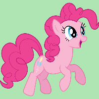
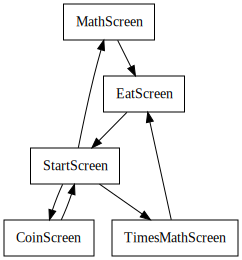

# Power App Documentation \- PonyMath

| Property                   | Value                                                          |
| -------------------------- | -------------------------------------------------------------- |
| App Name                   | PonyMath                                                       |
| App Logo                   |  |
| Documentation generated at | Monday, 21 November 2022 1:25 pm                               |

- [Overview](index-PonyMath.md)
- [App Details](appdetails-PonyMath.md)
- [Variables](variables-PonyMath.md)
- [DataSources](datasources-PonyMath.md)
- [Resources](resources-PonyMath.md)
- [Controls](controls-PonyMath.md)

## Controls Overview

A total of 5 Screens are located in the app.

A total of 57 Controls are located in the app.

### [Screen: CoinScreen](screen-CoinScreen-PonyMath.md)

<table width="100%" style="padding:2px;"><tr><td></td><td><a href="screen-CoinScreen-PonyMath.md#CoinScreen">CoinScreen [screen]</a></td><tr><tr><td></td><td><table width="100%" style="padding:2px;"><tr><td></td><td><a href="screen-CoinScreen-PonyMath.md#Button3_1">Button3_1 [button]</a></td><tr></table></td></tr><tr><td></td><td><table width="100%" style="padding:2px;"><tr><td></td><td><a href="screen-CoinScreen-PonyMath.md#Button4">Button4 [button]</a></td><tr></table></td></tr><tr><td></td><td><table width="100%" style="padding:2px;"><tr><td></td><td><a href="screen-CoinScreen-PonyMath.md#Gallery1">Gallery1 [gallery]</a></td><tr><tr><td></td><td><table width="100%" style="padding:2px;"><tr><td></td><td><a href="screen-CoinScreen-PonyMath.md#galleryTemplate1">galleryTemplate1 [galleryTemplate]</a></td><tr></table></td></tr><tr><td></td><td><table width="100%" style="padding:2px;"><tr><td></td><td><a href="screen-CoinScreen-PonyMath.md#Image1">Image1 [image]</a></td><tr></table></td></tr></table></td></tr><tr><td></td><td><table width="100%" style="padding:2px;"><tr><td></td><td><a href="screen-CoinScreen-PonyMath.md#HappyAppleJack">HappyAppleJack [image]</a></td><tr></table></td></tr><tr><td></td><td><table width="100%" style="padding:2px;"><tr><td></td><td><a href="screen-CoinScreen-PonyMath.md#HiddenGenerateButton">HiddenGenerateButton [button]</a></td><tr></table></td></tr><tr><td></td><td><table width="100%" style="padding:2px;"><tr><td></td><td><a href="screen-CoinScreen-PonyMath.md#Image5">Image5 [image]</a></td><tr></table></td></tr><tr><td></td><td><table width="100%" style="padding:2px;"><tr><td></td><td><a href="screen-CoinScreen-PonyMath.md#Image5_1">Image5_1 [image]</a></td><tr></table></td></tr><tr><td></td><td><table width="100%" style="padding:2px;"><tr><td></td><td><a href="screen-CoinScreen-PonyMath.md#Image5_2">Image5_2 [image]</a></td><tr></table></td></tr><tr><td></td><td><table width="100%" style="padding:2px;"><tr><td></td><td><a href="screen-CoinScreen-PonyMath.md#Image5_3">Image5_3 [image]</a></td><tr></table></td></tr><tr><td></td><td><table width="100%" style="padding:2px;"><tr><td></td><td><a href="screen-CoinScreen-PonyMath.md#Image6">Image6 [image]</a></td><tr></table></td></tr><tr><td></td><td><table width="100%" style="padding:2px;"><tr><td></td><td><a href="screen-CoinScreen-PonyMath.md#Label1">Label1 [label]</a></td><tr></table></td></tr></table>

### [Screen: EatScreen](screen-EatScreen-PonyMath.md)

<table width="100%" style="padding:2px;"><tr><td></td><td><a href="screen-EatScreen-PonyMath.md#EatScreen">EatScreen [screen]</a></td><tr><tr><td></td><td><table width="100%" style="padding:2px;"><tr><td></td><td><a href="screen-EatScreen-PonyMath.md#Button3">Button3 [button]</a></td><tr></table></td></tr><tr><td></td><td><table width="100%" style="padding:2px;"><tr><td></td><td><a href="screen-EatScreen-PonyMath.md#Image2">Image2 [image]</a></td><tr></table></td></tr></table>

### [Screen: MathScreen](screen-MathScreen-PonyMath.md)

<table width="100%" style="padding:2px;"><tr><td></td><td><a href="screen-MathScreen-PonyMath.md#MathScreen">MathScreen [screen]</a></td><tr><tr><td></td><td><table width="100%" style="padding:2px;"><tr><td></td><td><a href="screen-MathScreen-PonyMath.md#Button1">Button1 [button]</a></td><tr></table></td></tr><tr><td></td><td><table width="100%" style="padding:2px;"><tr><td></td><td><a href="screen-MathScreen-PonyMath.md#Button1_1">Button1_1 [button]</a></td><tr></table></td></tr><tr><td></td><td><table width="100%" style="padding:2px;"><tr><td></td><td><a href="screen-MathScreen-PonyMath.md#Button1_2">Button1_2 [button]</a></td><tr></table></td></tr><tr><td></td><td><table width="100%" style="padding:2px;"><tr><td></td><td><a href="screen-MathScreen-PonyMath.md#Button1_3">Button1_3 [button]</a></td><tr></table></td></tr><tr><td></td><td><table width="100%" style="padding:2px;"><tr><td></td><td><a href="screen-MathScreen-PonyMath.md#Button1_4">Button1_4 [button]</a></td><tr></table></td></tr><tr><td></td><td><table width="100%" style="padding:2px;"><tr><td></td><td><a href="screen-MathScreen-PonyMath.md#Button1_5">Button1_5 [button]</a></td><tr></table></td></tr><tr><td></td><td><table width="100%" style="padding:2px;"><tr><td></td><td><a href="screen-MathScreen-PonyMath.md#Button1_6">Button1_6 [button]</a></td><tr></table></td></tr><tr><td></td><td><table width="100%" style="padding:2px;"><tr><td></td><td><a href="screen-MathScreen-PonyMath.md#Button1_7">Button1_7 [button]</a></td><tr></table></td></tr><tr><td></td><td><table width="100%" style="padding:2px;"><tr><td></td><td><a href="screen-MathScreen-PonyMath.md#Button1_8">Button1_8 [button]</a></td><tr></table></td></tr><tr><td></td><td><table width="100%" style="padding:2px;"><tr><td></td><td><a href="screen-MathScreen-PonyMath.md#Circle1">Circle1 [circle]</a></td><tr></table></td></tr><tr><td></td><td><table width="100%" style="padding:2px;"><tr><td></td><td><a href="screen-MathScreen-PonyMath.md#Circle1_1">Circle1_1 [circle]</a></td><tr></table></td></tr><tr><td></td><td><table width="100%" style="padding:2px;"><tr><td></td><td><a href="screen-MathScreen-PonyMath.md#Circle1_2">Circle1_2 [circle]</a></td><tr></table></td></tr><tr><td></td><td><table width="100%" style="padding:2px;"><tr><td></td><td><a href="screen-MathScreen-PonyMath.md#HiddenGeneratorButton">HiddenGeneratorButton [button]</a></td><tr></table></td></tr><tr><td></td><td><table width="100%" style="padding:2px;"><tr><td></td><td><a href="screen-MathScreen-PonyMath.md#HiddenValidationButton">HiddenValidationButton [button]</a></td><tr></table></td></tr><tr><td></td><td><table width="100%" style="padding:2px;"><tr><td></td><td><a href="screen-MathScreen-PonyMath.md#Image3">Image3 [image]</a></td><tr></table></td></tr><tr><td></td><td><table width="100%" style="padding:2px;"><tr><td></td><td><a href="screen-MathScreen-PonyMath.md#Number1">Number1 [label]</a></td><tr></table></td></tr><tr><td></td><td><table width="100%" style="padding:2px;"><tr><td></td><td><a href="screen-MathScreen-PonyMath.md#Number2">Number2 [label]</a></td><tr></table></td></tr><tr><td></td><td><table width="100%" style="padding:2px;"><tr><td></td><td><a href="screen-MathScreen-PonyMath.md#Number3">Number3 [label]</a></td><tr></table></td></tr><tr><td></td><td><table width="100%" style="padding:2px;"><tr><td></td><td><a href="screen-MathScreen-PonyMath.md#PinkiePie">PinkiePie [image]</a></td><tr></table></td></tr></table>

### [Screen: StartScreen](screen-StartScreen-PonyMath.md)

<table width="100%" style="padding:2px;"><tr><td></td><td><a href="screen-StartScreen-PonyMath.md#StartScreen">StartScreen [screen]</a></td><tr><tr><td></td><td><table width="100%" style="padding:2px;"><tr><td></td><td><a href="screen-StartScreen-PonyMath.md#Image4">Image4 [image]</a></td><tr></table></td></tr><tr><td></td><td><table width="100%" style="padding:2px;"><tr><td></td><td><a href="screen-StartScreen-PonyMath.md#Image4_1">Image4_1 [image]</a></td><tr></table></td></tr><tr><td></td><td><table width="100%" style="padding:2px;"><tr><td></td><td><a href="screen-StartScreen-PonyMath.md#Image4_2">Image4_2 [image]</a></td><tr></table></td></tr><tr><td></td><td><table width="100%" style="padding:2px;"><tr><td></td><td><a href="screen-StartScreen-PonyMath.md#Image7">Image7 [image]</a></td><tr></table></td></tr></table>

### [Screen: TimesMathScreen](screen-TimesMathScreen-PonyMath.md)

<table width="100%" style="padding:2px;"><tr><td></td><td><a href="screen-TimesMathScreen-PonyMath.md#TimesMathScreen">TimesMathScreen [screen]</a></td><tr><tr><td></td><td><table width="100%" style="padding:2px;"><tr><td></td><td><a href="screen-TimesMathScreen-PonyMath.md#AnswerList">AnswerList [listbox]</a></td><tr></table></td></tr><tr><td></td><td><table width="100%" style="padding:2px;"><tr><td></td><td><a href="screen-TimesMathScreen-PonyMath.md#Button1_9">Button1_9 [button]</a></td><tr></table></td></tr><tr><td></td><td><table width="100%" style="padding:2px;"><tr><td></td><td><a href="screen-TimesMathScreen-PonyMath.md#Circle1_3">Circle1_3 [circle]</a></td><tr></table></td></tr><tr><td></td><td><table width="100%" style="padding:2px;"><tr><td></td><td><a href="screen-TimesMathScreen-PonyMath.md#Circle1_4">Circle1_4 [circle]</a></td><tr></table></td></tr><tr><td></td><td><table width="100%" style="padding:2px;"><tr><td></td><td><a href="screen-TimesMathScreen-PonyMath.md#Circle1_5">Circle1_5 [circle]</a></td><tr></table></td></tr><tr><td></td><td><table width="100%" style="padding:2px;"><tr><td></td><td><a href="screen-TimesMathScreen-PonyMath.md#HiddenGeneratorButton_1">HiddenGeneratorButton_1 [button]</a></td><tr></table></td></tr><tr><td></td><td><table width="100%" style="padding:2px;"><tr><td></td><td><a href="screen-TimesMathScreen-PonyMath.md#HiddenValidationButton_1">HiddenValidationButton_1 [button]</a></td><tr></table></td></tr><tr><td></td><td><table width="100%" style="padding:2px;"><tr><td></td><td><a href="screen-TimesMathScreen-PonyMath.md#Image3_1">Image3_1 [image]</a></td><tr></table></td></tr><tr><td></td><td><table width="100%" style="padding:2px;"><tr><td></td><td><a href="screen-TimesMathScreen-PonyMath.md#Label2">Label2 [label]</a></td><tr></table></td></tr><tr><td></td><td><table width="100%" style="padding:2px;"><tr><td></td><td><a href="screen-TimesMathScreen-PonyMath.md#Number1_1">Number1_1 [label]</a></td><tr></table></td></tr><tr><td></td><td><table width="100%" style="padding:2px;"><tr><td></td><td><a href="screen-TimesMathScreen-PonyMath.md#Number2_1">Number2_1 [label]</a></td><tr></table></td></tr><tr><td></td><td><table width="100%" style="padding:2px;"><tr><td></td><td><a href="screen-TimesMathScreen-PonyMath.md#Number3_1">Number3_1 [label]</a></td><tr></table></td></tr><tr><td></td><td><table width="100%" style="padding:2px;"><tr><td></td><td><a href="screen-TimesMathScreen-PonyMath.md#PinkiePie_1">PinkiePie_1 [image]</a></td><tr></table></td></tr></table>

## Screen Navigation

The following diagram shows the navigation between the different screens.

