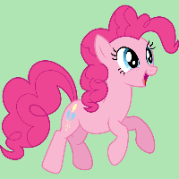

# Power App Documentation \- PonyMath

| Property                   | Value                                                          |
| -------------------------- | -------------------------------------------------------------- |
| App Name                   | PonyMath                                                       |
| App Logo                   |  |
| Documentation generated at | Monday, 21 November 2022 1:31 pm                               |

- [Overview](index-PonyMath.md)
- [App Details](appdetails-PonyMath.md)
- [Variables](variables-PonyMath.md)
- [DataSources](datasources-PonyMath.md)
- [Resources](resources-PonyMath.md)
- [Controls](controls-PonyMath.md)

## CoinScreen

### Behavior

| Property  | Value                                                                                                                                                                        |
| --------- | ---------------------------------------------------------------------------------------------------------------------------------------------------------------------------- |
| OnVisible | ClearCollect( PaymentCoins, { Value: 5, pic: '5cent' }, { Value: 10, pic: '10cent' } );Clear(PaymentCoins); Set( TotalAmount, RoundDown( Rand() \* (29 \- 3 + 1) + 3, 0 ) ); |

### Design

| Property            | Value                                                                                                               |
| ------------------- | ------------------------------------------------------------------------------------------------------------------- |
| Height              | Max(App.Height, App.DesignHeight)                                                                                   |
| ImagePosition       | ImagePosition.Fit                                                                                                   |
| LoadingSpinner      | LoadingSpinner.None                                                                                                 |
| LoadingSpinnerColor | <table border="0"><tr><td>RGBA(56, 96, 178, 1)</td></tr><tr><td style="background-color:#3860B2"></td></tr></table> |
| Orientation         | If(CoinScreen.Width \< CoinScreen.Height, Layout.Vertical, Layout.Horizontal)                                       |
| Size                | 1 + CountRows(App.SizeBreakpoints) \- CountIf(App.SizeBreakpoints, Value \>\= CoinScreen.Width)                     |
| Width               | Max(App.Width, App.DesignWidth)                                                                                     |

### Color Properties

| Property | Value                                                                                                                 |
| -------- | --------------------------------------------------------------------------------------------------------------------- |
| Fill     | <table border="0"><tr><td>RGBA(255, 255, 255, 1)</td></tr><tr><td style="background-color:#FFFFFF"></td></tr></table> |

### Child & Parent Controls

| Property      | Value                |
| ------------- | -------------------- |
| Child Control | HappyAppleJack       |
| Child Control | Image6               |
| Child Control | Gallery1             |
| Child Control | Image5\_3            |
| Child Control | Image5\_2            |
| Child Control | Image5\_1            |
| Child Control | Image5               |
| Child Control | Label1               |
| Child Control | HiddenGenerateButton |
| Child Control | Button4              |
| Child Control | Button3\_1           |

### Button3\_1

### Behavior

| Property | Value                 |
| -------- | --------------------- |
| OnSelect | Navigate(StartScreen) |

### Data

| Property        | Value         |
| --------------- | ------------- |
| ContentLanguage | ""            |
| Text            | "I'm done\! " |

### Design

| Property               | Value                |
| ---------------------- | -------------------- |
| Align                  | Align.Center         |
| BorderStyle            | BorderStyle.Solid    |
| BorderThickness        | 2                    |
| DisplayMode            | DisplayMode.Edit     |
| FocusedBorderThickness | 4                    |
| Font                   | Font.'Open Sans'     |
| FontWeight             | FontWeight.Semibold  |
| Height                 | 70                   |
| Italic                 | false                |
| RadiusBottomLeft       | 10                   |
| RadiusBottomRight      | 10                   |
| RadiusTopLeft          | 10                   |
| RadiusTopRight         | 10                   |
| Size                   | 24                   |
| Strikethrough          | false                |
| Underline              | false                |
| VerticalAlign          | VerticalAlign.Middle |
| Width                  | 182                  |
| X                      | 927                  |
| Y                      | 553                  |
| ZIndex                 | 12                   |

### Color Properties

| Property            | Value                                                                                                                 |
| ------------------- | --------------------------------------------------------------------------------------------------------------------- |
| BorderColor         | ColorFade(Button3\_1.Fill, \-15%)                                                                                     |
| Color               | <table border="0"><tr><td>RGBA(255, 255, 255, 1)</td></tr><tr><td style="background-color:#FFFFFF"></td></tr></table> |
| DisabledBorderColor | <table border="0"><tr><td>RGBA(166, 166, 166, 1)</td></tr><tr><td style="background-color:#A6A6A6"></td></tr></table> |
| DisabledColor       | <table border="0"><tr><td>RGBA(166, 166, 166, 1)</td></tr><tr><td style="background-color:#A6A6A6"></td></tr></table> |
| DisabledFill        | <table border="0"><tr><td>RGBA(244, 244, 244, 1)</td></tr><tr><td style="background-color:#F4F4F4"></td></tr></table> |
| Fill                | <table border="0"><tr><td>RGBA(241, 61, 148, 1)</td></tr><tr><td style="background-color:#F13D94"></td></tr></table>  |
| FocusedBorderColor  | Button3\_1.BorderColor                                                                                                |
| HoverBorderColor    | ColorFade(Button3\_1.BorderColor, 20%)                                                                                |
| HoverColor          | <table border="0"><tr><td>RGBA(255, 255, 255, 1)</td></tr><tr><td style="background-color:#FFFFFF"></td></tr></table> |
| HoverFill           | ColorFade(RGBA(56, 96, 178, 1), \-20%)                                                                                |
| PressedBorderColor  | Button3\_1.Fill                                                                                                       |
| PressedColor        | Button3\_1.Fill                                                                                                       |
| PressedFill         | Button3\_1.Color                                                                                                      |

### Child & Parent Controls

| Property       | Value      |
| -------------- | ---------- |
| Parent Control | CoinScreen |

### Button4

### Behavior

| Property | Value                                                                                                |
| -------- | ---------------------------------------------------------------------------------------------------- |
| OnSelect | If(Sum(PaymentCoins,Value)\=TotalAmount,Set(GiveMoneyResult,"Correct"),Set(GiveMoneyResult,"wrong")) |

### Data

| Property        | Value                |
| --------------- | -------------------- |
| ContentLanguage | ""                   |
| Text            | "Give to Applejack " |

### Design

| Property               | Value                |
| ---------------------- | -------------------- |
| Align                  | Align.Center         |
| BorderStyle            | BorderStyle.Solid    |
| BorderThickness        | 2                    |
| DisplayMode            | DisplayMode.Edit     |
| FocusedBorderThickness | 4                    |
| Font                   | Font.'Open Sans'     |
| FontWeight             | FontWeight.Semibold  |
| Height                 | 70                   |
| Italic                 | false                |
| RadiusBottomLeft       | 10                   |
| RadiusBottomRight      | 10                   |
| RadiusTopLeft          | 10                   |
| RadiusTopRight         | 10                   |
| Size                   | 24                   |
| Strikethrough          | false                |
| Underline              | false                |
| VerticalAlign          | VerticalAlign.Middle |
| Width                  | 280                  |
| X                      | 605                  |
| Y                      | 553                  |
| ZIndex                 | 9                    |

### Color Properties

| Property            | Value                                                                                                                 |
| ------------------- | --------------------------------------------------------------------------------------------------------------------- |
| BorderColor         | ColorFade(Button4.Fill, \-15%)                                                                                        |
| Color               | <table border="0"><tr><td>RGBA(255, 255, 255, 1)</td></tr><tr><td style="background-color:#FFFFFF"></td></tr></table> |
| DisabledBorderColor | <table border="0"><tr><td>RGBA(166, 166, 166, 1)</td></tr><tr><td style="background-color:#A6A6A6"></td></tr></table> |
| DisabledColor       | <table border="0"><tr><td>RGBA(166, 166, 166, 1)</td></tr><tr><td style="background-color:#A6A6A6"></td></tr></table> |
| DisabledFill        | <table border="0"><tr><td>RGBA(244, 244, 244, 1)</td></tr><tr><td style="background-color:#F4F4F4"></td></tr></table> |
| Fill                | <table border="0"><tr><td>RGBA(255, 195, 96, 1)</td></tr><tr><td style="background-color:#FFC360"></td></tr></table>  |
| FocusedBorderColor  | Button4.BorderColor                                                                                                   |
| HoverBorderColor    | ColorFade(Button4.BorderColor, 20%)                                                                                   |
| HoverColor          | <table border="0"><tr><td>RGBA(255, 255, 255, 1)</td></tr><tr><td style="background-color:#FFFFFF"></td></tr></table> |
| HoverFill           | ColorFade(RGBA(56, 96, 178, 1), \-20%)                                                                                |
| PressedBorderColor  | Button4.Fill                                                                                                          |
| PressedColor        | Button4.Fill                                                                                                          |
| PressedFill         | Button4.Color                                                                                                         |

### Child & Parent Controls

| Property       | Value      |
| -------------- | ---------- |
| Parent Control | CoinScreen |

### CoinScreen

### Behavior

| Property  | Value                                                                                                                                                                        |
| --------- | ---------------------------------------------------------------------------------------------------------------------------------------------------------------------------- |
| OnVisible | ClearCollect( PaymentCoins, { Value: 5, pic: '5cent' }, { Value: 10, pic: '10cent' } );Clear(PaymentCoins); Set( TotalAmount, RoundDown( Rand() \* (29 \- 3 + 1) + 3, 0 ) ); |

### Design

| Property            | Value                                                                                                               |
| ------------------- | ------------------------------------------------------------------------------------------------------------------- |
| Height              | Max(App.Height, App.DesignHeight)                                                                                   |
| ImagePosition       | ImagePosition.Fit                                                                                                   |
| LoadingSpinner      | LoadingSpinner.None                                                                                                 |
| LoadingSpinnerColor | <table border="0"><tr><td>RGBA(56, 96, 178, 1)</td></tr><tr><td style="background-color:#3860B2"></td></tr></table> |
| Orientation         | If(CoinScreen.Width \< CoinScreen.Height, Layout.Vertical, Layout.Horizontal)                                       |
| Size                | 1 + CountRows(App.SizeBreakpoints) \- CountIf(App.SizeBreakpoints, Value \>\= CoinScreen.Width)                     |
| Width               | Max(App.Width, App.DesignWidth)                                                                                     |

### Color Properties

| Property | Value                                                                                                                 |
| -------- | --------------------------------------------------------------------------------------------------------------------- |
| Fill     | <table border="0"><tr><td>RGBA(255, 255, 255, 1)</td></tr><tr><td style="background-color:#FFFFFF"></td></tr></table> |

### Child & Parent Controls

| Property      | Value                |
| ------------- | -------------------- |
| Child Control | HappyAppleJack       |
| Child Control | Image6               |
| Child Control | Gallery1             |
| Child Control | Image5\_3            |
| Child Control | Image5\_2            |
| Child Control | Image5\_1            |
| Child Control | Image5               |
| Child Control | Label1               |
| Child Control | HiddenGenerateButton |
| Child Control | Button4              |
| Child Control | Button3\_1           |

### Gallery1

### Data

| Property        | Value        |
| --------------- | ------------ |
| ContentLanguage | ""           |
| Items           | PaymentCoins |
| WrapCount       | 2            |

### Design

| Property               | Value               |
| ---------------------- | ------------------- |
| BorderStyle            | BorderStyle.Solid   |
| DelayItemLoading       | false               |
| DisplayMode            | DisplayMode.Edit    |
| FocusedBorderThickness | 4                   |
| Height                 | 285                 |
| Layout                 | Layout.Horizontal   |
| LoadingSpinner         | LoadingSpinner.None |
| LoadingSpinnerColor    | Self.BorderColor    |
| TabIndex               | \-1                 |
| TemplatePadding        | 0                   |
| TemplateSize           | 160                 |
| Transition             | Transition.None     |
| Width                  | 485                 |
| X                      | 517                 |
| Y                      | 38                  |
| ZIndex                 | 3                   |

### Color Properties

| Property            | Value                                                                                                                |
| ------------------- | -------------------------------------------------------------------------------------------------------------------- |
| BorderColor         | <table border="0"><tr><td>RGBA(0, 18, 107, 1)</td></tr><tr><td style="background-color:#00126B"></td></tr></table>   |
| DisabledBorderColor | Gallery1.BorderColor                                                                                                 |
| DisabledFill        | Gallery1.Fill                                                                                                        |
| Fill                | <table border="0"><tr><td>RGBA(255, 195, 96, 1)</td></tr><tr><td style="background-color:#FFC360"></td></tr></table> |
| FocusedBorderColor  | Self.BorderColor                                                                                                     |
| HoverBorderColor    | Gallery1.BorderColor                                                                                                 |
| HoverFill           | Gallery1.Fill                                                                                                        |
| PressedBorderColor  | Gallery1.BorderColor                                                                                                 |
| PressedFill         | Gallery1.Fill                                                                                                        |

### Child & Parent Controls

| Property       | Value            |
| -------------- | ---------------- |
| Child Control  | galleryTemplate1 |
| Child Control  | Image1           |
| Parent Control | CoinScreen       |

### galleryTemplate1

### Design

| Property     | Value                                                                                                           |
| ------------ | --------------------------------------------------------------------------------------------------------------- |
| TemplateFill | <table border="0"><tr><td>RGBA(0, 0, 0, 0)</td></tr><tr><td style="background-color:#000000"></td></tr></table> |

### Color Properties

### Child & Parent Controls

| Property       | Value    |
| -------------- | -------- |
| Parent Control | Gallery1 |

### HappyAppleJack

### Behavior

| Property | Value                         |
| -------- | ----------------------------- |
| OnSelect | Select(HiddenGenerateButton); |

### Data

| Property        | Value          |
| --------------- | -------------- |
| ContentLanguage | ""             |
| Image           | happyapplejack |

### Design

| Property               | Value                                              |
| ---------------------- | -------------------------------------------------- |
| BorderStyle            | BorderStyle.Solid                                  |
| BorderThickness        | 0                                                  |
| DisplayMode            | DisplayMode.Edit                                   |
| FocusedBorderThickness | 2                                                  |
| Height                 | If(GiveMoneyResult\="Correct",CoinScreen.Height,1) |
| ImagePosition          | ImagePosition.Fit                                  |
| ImageRotation          | ImageRotation.None                                 |
| PaddingBottom          | 0                                                  |
| PaddingLeft            | 0                                                  |
| PaddingRight           | 0                                                  |
| PaddingTop             | 0                                                  |
| RadiusBottomLeft       | 0                                                  |
| RadiusBottomRight      | 0                                                  |
| RadiusTopLeft          | 0                                                  |
| RadiusTopRight         | 0                                                  |
| Visible                | GiveMoneyResult\="Correct"                         |
| Width                  | If(GiveMoneyResult\="Correct",CoinScreen.Width,1)  |
| X                      | 0                                                  |
| Y                      | 0                                                  |
| ZIndex                 | 11                                                 |

### Color Properties

| Property            | Value                                                                                                                 |
| ------------------- | --------------------------------------------------------------------------------------------------------------------- |
| BorderColor         | <table border="0"><tr><td>RGBA(0, 18, 107, 1)</td></tr><tr><td style="background-color:#00126B"></td></tr></table>    |
| DisabledBorderColor | <table border="0"><tr><td>RGBA(166, 166, 166, 1)</td></tr><tr><td style="background-color:#A6A6A6"></td></tr></table> |
| DisabledFill        | <table border="0"><tr><td>RGBA(244, 244, 244, 1)</td></tr><tr><td style="background-color:#F4F4F4"></td></tr></table> |
| Fill                | <table border="0"><tr><td>RGBA(0, 0, 0, 0)</td></tr><tr><td style="background-color:#000000"></td></tr></table>       |
| FocusedBorderColor  | HappyAppleJack.BorderColor                                                                                            |
| HoverBorderColor    | ColorFade(HappyAppleJack.BorderColor, 20%)                                                                            |
| HoverFill           | ColorFade(HappyAppleJack.Fill, 20%)                                                                                   |
| PressedBorderColor  | ColorFade(HappyAppleJack.BorderColor, \-20%)                                                                          |
| PressedFill         | ColorFade(HappyAppleJack.Fill, \-20%)                                                                                 |

### Child & Parent Controls

| Property       | Value      |
| -------------- | ---------- |
| Parent Control | CoinScreen |

### HiddenGenerateButton

### Behavior

| Property | Value                                                                                          |
| -------- | ---------------------------------------------------------------------------------------------- |
| OnSelect | Set(GiveMoneyResult,"");Clear(PaymentCoins);Set(TotalAmount,RoundDown(Rand()\*(29\-3+1)+3,0)); |

### Data

| Property        | Value    |
| --------------- | -------- |
| ContentLanguage | ""       |
| Text            | "Button" |

### Design

| Property               | Value                |
| ---------------------- | -------------------- |
| Align                  | Align.Center         |
| BorderStyle            | BorderStyle.Solid    |
| BorderThickness        | 2                    |
| DisplayMode            | DisplayMode.Edit     |
| FocusedBorderThickness | 4                    |
| Font                   | Font.'Open Sans'     |
| FontWeight             | FontWeight.Semibold  |
| Height                 | 70                   |
| Italic                 | false                |
| RadiusBottomLeft       | 10                   |
| RadiusBottomRight      | 10                   |
| RadiusTopLeft          | 10                   |
| RadiusTopRight         | 10                   |
| Size                   | 24                   |
| Strikethrough          | false                |
| Underline              | false                |
| VerticalAlign          | VerticalAlign.Middle |
| Visible                | false                |
| Width                  | 280                  |
| X                      | 54                   |
| Y                      | 553                  |
| ZIndex                 | 2                    |

### Color Properties

| Property            | Value                                                                                                                 |
| ------------------- | --------------------------------------------------------------------------------------------------------------------- |
| BorderColor         | ColorFade(HiddenGenerateButton.Fill, \-15%)                                                                           |
| Color               | <table border="0"><tr><td>RGBA(255, 255, 255, 1)</td></tr><tr><td style="background-color:#FFFFFF"></td></tr></table> |
| DisabledBorderColor | <table border="0"><tr><td>RGBA(166, 166, 166, 1)</td></tr><tr><td style="background-color:#A6A6A6"></td></tr></table> |
| DisabledColor       | <table border="0"><tr><td>RGBA(166, 166, 166, 1)</td></tr><tr><td style="background-color:#A6A6A6"></td></tr></table> |
| DisabledFill        | <table border="0"><tr><td>RGBA(244, 244, 244, 1)</td></tr><tr><td style="background-color:#F4F4F4"></td></tr></table> |
| Fill                | <table border="0"><tr><td>RGBA(56, 96, 178, 1)</td></tr><tr><td style="background-color:#3860B2"></td></tr></table>   |
| FocusedBorderColor  | HiddenGenerateButton.BorderColor                                                                                      |
| HoverBorderColor    | ColorFade(HiddenGenerateButton.BorderColor, 20%)                                                                      |
| HoverColor          | <table border="0"><tr><td>RGBA(255, 255, 255, 1)</td></tr><tr><td style="background-color:#FFFFFF"></td></tr></table> |
| HoverFill           | ColorFade(RGBA(56, 96, 178, 1), \-20%)                                                                                |
| PressedBorderColor  | HiddenGenerateButton.Fill                                                                                             |
| PressedColor        | HiddenGenerateButton.Fill                                                                                             |
| PressedFill         | HiddenGenerateButton.Color                                                                                            |

### Child & Parent Controls

| Property       | Value      |
| -------------- | ---------- |
| Parent Control | CoinScreen |

### Image1

### Behavior

| Property | Value                         |
| -------- | ----------------------------- |
| OnSelect | Remove(PaymentCoins,ThisItem) |

### Data

| Property        | Value        |
| --------------- | ------------ |
| ContentLanguage | ""           |
| Image           | ThisItem.pic |

### Design

| Property               | Value              |
| ---------------------- | ------------------ |
| BorderStyle            | BorderStyle.Solid  |
| BorderThickness        | 0                  |
| DisplayMode            | DisplayMode.Edit   |
| FocusedBorderThickness | 2                  |
| Height                 | 114                |
| ImagePosition          | ImagePosition.Fit  |
| ImageRotation          | ImageRotation.None |
| PaddingBottom          | 0                  |
| PaddingLeft            | 0                  |
| PaddingRight           | 0                  |
| PaddingTop             | 0                  |
| RadiusBottomLeft       | 0                  |
| RadiusBottomRight      | 0                  |
| RadiusTopLeft          | 0                  |
| RadiusTopRight         | 0                  |
| TabIndex               | \-1                |
| Width                  | 126                |
| X                      | 18                 |
| Y                      | 18                 |
| ZIndex                 | 1                  |

### Color Properties

| Property            | Value                                                                                                                 |
| ------------------- | --------------------------------------------------------------------------------------------------------------------- |
| BorderColor         | <table border="0"><tr><td>RGBA(0, 18, 107, 1)</td></tr><tr><td style="background-color:#00126B"></td></tr></table>    |
| DisabledBorderColor | <table border="0"><tr><td>RGBA(166, 166, 166, 1)</td></tr><tr><td style="background-color:#A6A6A6"></td></tr></table> |
| DisabledFill        | <table border="0"><tr><td>RGBA(244, 244, 244, 1)</td></tr><tr><td style="background-color:#F4F4F4"></td></tr></table> |
| Fill                | <table border="0"><tr><td>RGBA(0, 0, 0, 0)</td></tr><tr><td style="background-color:#000000"></td></tr></table>       |
| FocusedBorderColor  | Image1.BorderColor                                                                                                    |
| HoverBorderColor    | ColorFade(Image1.BorderColor, 20%)                                                                                    |
| HoverFill           | ColorFade(Image1.Fill, 20%)                                                                                           |
| PressedBorderColor  | ColorFade(Image1.BorderColor, \-20%)                                                                                  |
| PressedFill         | ColorFade(Image1.Fill, \-20%)                                                                                         |

### Child & Parent Controls

| Property       | Value    |
| -------------- | -------- |
| Parent Control | Gallery1 |

### Image5

### Behavior

| Property | Value                                        |
| -------- | -------------------------------------------- |
| OnSelect | Collect(PaymentCoins,{Value:1,pic:'10cent'}) |

### Data

| Property        | Value    |
| --------------- | -------- |
| ContentLanguage | ""       |
| Image           | '10cent' |

### Design

| Property               | Value              |
| ---------------------- | ------------------ |
| BorderStyle            | BorderStyle.Solid  |
| BorderThickness        | 0                  |
| DisplayMode            | DisplayMode.Edit   |
| FocusedBorderThickness | 2                  |
| Height                 | 124                |
| ImagePosition          | ImagePosition.Fit  |
| ImageRotation          | ImageRotation.None |
| PaddingBottom          | 0                  |
| PaddingLeft            | 0                  |
| PaddingRight           | 0                  |
| PaddingTop             | 0                  |
| RadiusBottomLeft       | 0                  |
| RadiusBottomRight      | 0                  |
| RadiusTopLeft          | 0                  |
| RadiusTopRight         | 0                  |
| Width                  | 132                |
| X                      | 462                |
| Y                      | 378                |
| ZIndex                 | 4                  |

### Color Properties

| Property            | Value                                                                                                                 |
| ------------------- | --------------------------------------------------------------------------------------------------------------------- |
| BorderColor         | <table border="0"><tr><td>RGBA(0, 18, 107, 1)</td></tr><tr><td style="background-color:#00126B"></td></tr></table>    |
| DisabledBorderColor | <table border="0"><tr><td>RGBA(166, 166, 166, 1)</td></tr><tr><td style="background-color:#A6A6A6"></td></tr></table> |
| DisabledFill        | <table border="0"><tr><td>RGBA(244, 244, 244, 1)</td></tr><tr><td style="background-color:#F4F4F4"></td></tr></table> |
| Fill                | <table border="0"><tr><td>RGBA(0, 0, 0, 0)</td></tr><tr><td style="background-color:#000000"></td></tr></table>       |
| FocusedBorderColor  | Image5.BorderColor                                                                                                    |
| HoverBorderColor    | ColorFade(Image5.BorderColor, 20%)                                                                                    |
| HoverFill           | ColorFade(Image5.Fill, 20%)                                                                                           |
| PressedBorderColor  | ColorFade(Image5.BorderColor, \-20%)                                                                                  |
| PressedFill         | ColorFade(Image5.Fill, \-20%)                                                                                         |

### Child & Parent Controls

| Property       | Value      |
| -------------- | ---------- |
| Parent Control | CoinScreen |

### Image5\_1

### Behavior

| Property | Value                                        |
| -------- | -------------------------------------------- |
| OnSelect | Collect(PaymentCoins,{Value:2,pic:'20cent'}) |

### Data

| Property        | Value    |
| --------------- | -------- |
| ContentLanguage | ""       |
| Image           | '20cent' |

### Design

| Property               | Value              |
| ---------------------- | ------------------ |
| BorderStyle            | BorderStyle.Solid  |
| BorderThickness        | 0                  |
| DisplayMode            | DisplayMode.Edit   |
| FocusedBorderThickness | 2                  |
| Height                 | 142                |
| ImagePosition          | ImagePosition.Fit  |
| ImageRotation          | ImageRotation.None |
| PaddingBottom          | 0                  |
| PaddingLeft            | 0                  |
| PaddingRight           | 0                  |
| PaddingTop             | 0                  |
| RadiusBottomLeft       | 0                  |
| RadiusBottomRight      | 0                  |
| RadiusTopLeft          | 0                  |
| RadiusTopRight         | 0                  |
| Width                  | 152                |
| X                      | 605                |
| Y                      | 369                |
| ZIndex                 | 5                  |

### Color Properties

| Property            | Value                                                                                                                 |
| ------------------- | --------------------------------------------------------------------------------------------------------------------- |
| BorderColor         | <table border="0"><tr><td>RGBA(0, 18, 107, 1)</td></tr><tr><td style="background-color:#00126B"></td></tr></table>    |
| DisabledBorderColor | <table border="0"><tr><td>RGBA(166, 166, 166, 1)</td></tr><tr><td style="background-color:#A6A6A6"></td></tr></table> |
| DisabledFill        | <table border="0"><tr><td>RGBA(244, 244, 244, 1)</td></tr><tr><td style="background-color:#F4F4F4"></td></tr></table> |
| Fill                | <table border="0"><tr><td>RGBA(0, 0, 0, 0)</td></tr><tr><td style="background-color:#000000"></td></tr></table>       |
| FocusedBorderColor  | Image5\_1.BorderColor                                                                                                 |
| HoverBorderColor    | ColorFade(Image5\_1.BorderColor, 20%)                                                                                 |
| HoverFill           | ColorFade(Image5\_1.Fill, 20%)                                                                                        |
| PressedBorderColor  | ColorFade(Image5\_1.BorderColor, \-20%)                                                                               |
| PressedFill         | ColorFade(Image5\_1.Fill, \-20%)                                                                                      |

### Child & Parent Controls

| Property       | Value      |
| -------------- | ---------- |
| Parent Control | CoinScreen |

### Image5\_2

### Behavior

| Property | Value                                        |
| -------- | -------------------------------------------- |
| OnSelect | Collect(PaymentCoins,{Value:5,pic:'50cent'}) |

### Data

| Property        | Value    |
| --------------- | -------- |
| ContentLanguage | ""       |
| Image           | '50cent' |

### Design

| Property               | Value              |
| ---------------------- | ------------------ |
| BorderStyle            | BorderStyle.Solid  |
| BorderThickness        | 0                  |
| DisplayMode            | DisplayMode.Edit   |
| FocusedBorderThickness | 2                  |
| Height                 | 163                |
| ImagePosition          | ImagePosition.Fit  |
| ImageRotation          | ImageRotation.None |
| PaddingBottom          | 0                  |
| PaddingLeft            | 0                  |
| PaddingRight           | 0                  |
| PaddingTop             | 0                  |
| RadiusBottomLeft       | 0                  |
| RadiusBottomRight      | 0                  |
| RadiusTopLeft          | 0                  |
| RadiusTopRight         | 0                  |
| Width                  | 174                |
| X                      | 749                |
| Y                      | 358                |
| ZIndex                 | 6                  |

### Color Properties

| Property            | Value                                                                                                                 |
| ------------------- | --------------------------------------------------------------------------------------------------------------------- |
| BorderColor         | <table border="0"><tr><td>RGBA(0, 18, 107, 1)</td></tr><tr><td style="background-color:#00126B"></td></tr></table>    |
| DisabledBorderColor | <table border="0"><tr><td>RGBA(166, 166, 166, 1)</td></tr><tr><td style="background-color:#A6A6A6"></td></tr></table> |
| DisabledFill        | <table border="0"><tr><td>RGBA(244, 244, 244, 1)</td></tr><tr><td style="background-color:#F4F4F4"></td></tr></table> |
| Fill                | <table border="0"><tr><td>RGBA(0, 0, 0, 0)</td></tr><tr><td style="background-color:#000000"></td></tr></table>       |
| FocusedBorderColor  | Image5\_2.BorderColor                                                                                                 |
| HoverBorderColor    | ColorFade(Image5\_2.BorderColor, 20%)                                                                                 |
| HoverFill           | ColorFade(Image5\_2.Fill, 20%)                                                                                        |
| PressedBorderColor  | ColorFade(Image5\_2.BorderColor, \-20%)                                                                               |
| PressedFill         | ColorFade(Image5\_2.Fill, \-20%)                                                                                      |

### Child & Parent Controls

| Property       | Value      |
| -------------- | ---------- |
| Parent Control | CoinScreen |

### Image5\_3

### Behavior

| Property | Value                                          |
| -------- | ---------------------------------------------- |
| OnSelect | Collect(PaymentCoins,{Value:10,pic:'1dollar'}) |

### Data

| Property        | Value     |
| --------------- | --------- |
| ContentLanguage | ""        |
| Image           | '1dollar' |

### Design

| Property               | Value              |
| ---------------------- | ------------------ |
| BorderStyle            | BorderStyle.Solid  |
| BorderThickness        | 0                  |
| DisplayMode            | DisplayMode.Edit   |
| FocusedBorderThickness | 2                  |
| Height                 | 170                |
| ImagePosition          | ImagePosition.Fit  |
| ImageRotation          | ImageRotation.None |
| PaddingBottom          | 0                  |
| PaddingLeft            | 0                  |
| PaddingRight           | 0                  |
| PaddingTop             | 0                  |
| RadiusBottomLeft       | 0                  |
| RadiusBottomRight      | 0                  |
| RadiusTopLeft          | 0                  |
| RadiusTopRight         | 0                  |
| Width                  | 182                |
| X                      | 927                |
| Y                      | 354                |
| ZIndex                 | 7                  |

### Color Properties

| Property            | Value                                                                                                                 |
| ------------------- | --------------------------------------------------------------------------------------------------------------------- |
| BorderColor         | <table border="0"><tr><td>RGBA(0, 18, 107, 1)</td></tr><tr><td style="background-color:#00126B"></td></tr></table>    |
| DisabledBorderColor | <table border="0"><tr><td>RGBA(166, 166, 166, 1)</td></tr><tr><td style="background-color:#A6A6A6"></td></tr></table> |
| DisabledFill        | <table border="0"><tr><td>RGBA(244, 244, 244, 1)</td></tr><tr><td style="background-color:#F4F4F4"></td></tr></table> |
| Fill                | <table border="0"><tr><td>RGBA(0, 0, 0, 0)</td></tr><tr><td style="background-color:#000000"></td></tr></table>       |
| FocusedBorderColor  | Image5\_3.BorderColor                                                                                                 |
| HoverBorderColor    | ColorFade(Image5\_3.BorderColor, 20%)                                                                                 |
| HoverFill           | ColorFade(Image5\_3.Fill, 20%)                                                                                        |
| PressedBorderColor  | ColorFade(Image5\_3.BorderColor, \-20%)                                                                               |
| PressedFill         | ColorFade(Image5\_3.Fill, \-20%)                                                                                      |

### Child & Parent Controls

| Property       | Value      |
| -------------- | ---------- |
| Parent Control | CoinScreen |

### Image6

### Data

| Property        | Value     |
| --------------- | --------- |
| ContentLanguage | ""        |
| Image           | applejack |

### Design

| Property               | Value              |
| ---------------------- | ------------------ |
| BorderStyle            | BorderStyle.Solid  |
| BorderThickness        | 0                  |
| DisplayMode            | DisplayMode.Edit   |
| FocusedBorderThickness | 2                  |
| Height                 | 414                |
| ImagePosition          | ImagePosition.Fit  |
| ImageRotation          | ImageRotation.None |
| PaddingBottom          | 0                  |
| PaddingLeft            | 0                  |
| PaddingRight           | 0                  |
| PaddingTop             | 0                  |
| RadiusBottomLeft       | 0                  |
| RadiusBottomRight      | 0                  |
| RadiusTopLeft          | 0                  |
| RadiusTopRight         | 0                  |
| Width                  | 414                |
| X                      | 36                 |
| Y                      | 22                 |
| ZIndex                 | 8                  |

### Color Properties

| Property            | Value                                                                                                                 |
| ------------------- | --------------------------------------------------------------------------------------------------------------------- |
| BorderColor         | <table border="0"><tr><td>RGBA(0, 18, 107, 1)</td></tr><tr><td style="background-color:#00126B"></td></tr></table>    |
| DisabledBorderColor | <table border="0"><tr><td>RGBA(166, 166, 166, 1)</td></tr><tr><td style="background-color:#A6A6A6"></td></tr></table> |
| DisabledFill        | <table border="0"><tr><td>RGBA(244, 244, 244, 1)</td></tr><tr><td style="background-color:#F4F4F4"></td></tr></table> |
| Fill                | <table border="0"><tr><td>RGBA(0, 0, 0, 0)</td></tr><tr><td style="background-color:#000000"></td></tr></table>       |
| FocusedBorderColor  | Image6.BorderColor                                                                                                    |
| HoverBorderColor    | ColorFade(Image6.BorderColor, 20%)                                                                                    |
| HoverFill           | ColorFade(Image6.Fill, 20%)                                                                                           |
| PressedBorderColor  | ColorFade(Image6.BorderColor, \-20%)                                                                                  |
| PressedFill         | ColorFade(Image6.Fill, \-20%)                                                                                         |

### Child & Parent Controls

| Property       | Value      |
| -------------- | ---------- |
| Parent Control | CoinScreen |

### Label1

### Data

| Property        | Value                                                                           |
| --------------- | ------------------------------------------------------------------------------- |
| ContentLanguage | ""                                                                              |
| Live            | Live.Off                                                                        |
| Role            | TextRole.Default                                                                |
| Text            | Concatenate("My apple pie costs $ ",Text(TotalAmount\/10,"\[$\-en\-US\]\#.00")) |

### Design

| Property               | Value                |
| ---------------------- | -------------------- |
| Align                  | Align.Left           |
| BorderStyle            | BorderStyle.Solid    |
| BorderThickness        | 0                    |
| DisplayMode            | DisplayMode.Edit     |
| FocusedBorderThickness | 0                    |
| Font                   | Font.'Open Sans'     |
| FontWeight             | FontWeight.Normal    |
| Height                 | 136                  |
| Italic                 | false                |
| LineHeight             | 1.2                  |
| Overflow               | Overflow.Hidden      |
| PaddingBottom          | 5                    |
| PaddingLeft            | 5                    |
| PaddingRight           | 5                    |
| PaddingTop             | 5                    |
| Size                   | 28                   |
| Strikethrough          | false                |
| Underline              | false                |
| VerticalAlign          | VerticalAlign.Middle |
| Width                  | 283                  |
| X                      | 101                  |
| Y                      | 436                  |
| ZIndex                 | 1                    |

### Color Properties

| Property            | Value                                                                                                                 |
| ------------------- | --------------------------------------------------------------------------------------------------------------------- |
| BorderColor         | <table border="0"><tr><td>RGBA(0, 18, 107, 1)</td></tr><tr><td style="background-color:#00126B"></td></tr></table>    |
| Color               | <table border="0"><tr><td>RGBA(0, 0, 0, 1)</td></tr><tr><td style="background-color:#000000"></td></tr></table>       |
| DisabledBorderColor | <table border="0"><tr><td>RGBA(56, 56, 56, 1)</td></tr><tr><td style="background-color:#383838"></td></tr></table>    |
| DisabledColor       | <table border="0"><tr><td>RGBA(166, 166, 166, 1)</td></tr><tr><td style="background-color:#A6A6A6"></td></tr></table> |
| DisabledFill        | <table border="0"><tr><td>RGBA(0, 0, 0, 0)</td></tr><tr><td style="background-color:#000000"></td></tr></table>       |
| Fill                | <table border="0"><tr><td>RGBA(0, 0, 0, 0)</td></tr><tr><td style="background-color:#000000"></td></tr></table>       |
| FocusedBorderColor  | Label1.BorderColor                                                                                                    |
| HoverBorderColor    | Label1.BorderColor                                                                                                    |
| HoverColor          | Label1.Color                                                                                                          |
| HoverFill           | Label1.Fill                                                                                                           |
| PressedBorderColor  | Label1.BorderColor                                                                                                    |
| PressedColor        | Label1.Color                                                                                                          |
| PressedFill         | Label1.Fill                                                                                                           |

### Child & Parent Controls

| Property       | Value      |
| -------------- | ---------- |
| Parent Control | CoinScreen |
